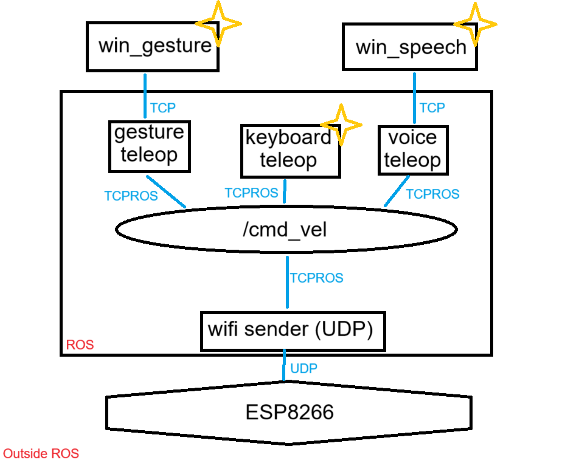

# ROS Teleoperation Project

This project enables teleoperation of a robot using multiple input methods including voice commands, gesture recognition, and WASD keyboard controls. The commands are sent over Wi-Fi using UDP to an ESP8266-based motor controller.

---

## Table of Contents

- [Project Overview](#project-overview)
- [Features](#features)
- [Hardware Setup](#hardware-setup)
- [Software Architecture](#software-architecture)
- [Project Structure](#project-structure)
- [Installation](#installation)
- [Configuration](#configuration)
- [Troubleshooting](#troubleshooting)
- [Acknowledgments](#acknowledgments)

---

## Project Overview

This repository contains ROS nodes and ESP8266 firmware to control a differential drive robot via Wi-Fi. It supports multiple teleoperation interfaces that translate user input into `/cmd_vel` velocity commands, which are then sent to an ESP8266 running a UDP server controlling the motors. Additional scripts are included for Windows users working within a WSL (Windows Subsystem for Linux) environment.
#---

## Features

- Voice-controlled teleoperation using speech commands.
- Gesture-based teleoperation using finger count gestures.
- WASD keyboard control.
- UDP communication to ESP8266 motor controller.
- Speed ramping for smooth acceleration and deceleration.
- Modular ROS packages for easy extension.

---

## Hardware Setup

- ESP8266 (NodeMCU or similar) Wi-Fi microcontroller.
- L298N motor driver module.
- Two DC motors for differential drive.
- Power supply suitable for motors and ESP8266.
- Wi-Fi network for UDP communication.

### Motor Pin Connections

| Pin        | Function             |
|------------|----------------------|
| ENA (GPIO12 / D6) | Left motor speed control (PWM) |
| IN1 (GPIO5 / D1)  | Left motor direction pin 1     |
| IN2 (GPIO4 / D2)  | Left motor direction pin 2     |
| ENB (GPIO13 / D7) | Right motor speed control (PWM)|
| IN3 (GPIO2 / D4)  | Right motor direction pin 1    |
| IN4 (GPIO14 / D5) | Right motor direction pin 2    |

---

## Software Architecture

- **ROS Nodes**: Python scripts that listen to teleoperation commands, process them, and publish velocity commands to `/cmd_vel`.
- **UDP Sender**: Subscribes to `/cmd_vel` and sends formatted velocity commands over UDP to the ESP8266.
- **ESP8266 Firmware**: Receives UDP packets, parses velocity commands, and controls motors accordingly.
- The following diagram illustrates the interaction between the different ROS nodes and the ESP8266 microcontroller:


---

## Project Structure
```
fdp62
├── build  # truncated for brevity
├── devel  # truncated for brevity
└── src
    ├── CMakeLists.txt
    ├── sender
    │   ├── CMakeLists.txt
    │   ├── package.xml
    │   ├── scripts
    │   │   └── wifi_sender.py
    │   └── src
    └── teleop
        ├── CMakeLists.txt
        ├── package.xml
        ├── scripts
        │   ├── gesture_teleop.py
        │   ├── voice_teleop.py
        │   └── wasd_teleop.py
        └── src
```

---

## Installation

### Prerequisites

- ROS (tested with ROS Noetic)
- Python 3
- ESP8266 development environment (Arduino IDE or PlatformIO)
- Wi-Fi network

### Build ROS Workspace

```bash
cd ~/fdp62
catkin_make
source devel/setup.bash
```

## Configuration

- **UDP IP and Port**  
  Update the IP address and UDP port in both the `wifi_sender.py` script and the ESP8266 firmware to match your local network configuration.

- **Wi-Fi Credentials**  
  Change the `ssid` and `password` variables in the ESP8266 code to connect it to your Wi-Fi network.

- **Motor Speed Calibration**  
  Adjust `left_motor_factor` and `right_motor_factor` in the ESP8266 code to balance the motor speeds for straight movement.

- **Ramping Parameters**  
  Modify acceleration and deceleration rates in teleop scripts if available, to achieve smoother control.

## Usage
1. Connect ESP to configured WIFI network
2. Run UDP sender ROS node
    ```
    rosrun sender wifi_sender.py
    ```
3. Run desired teleoperation node:
    ```
    rosrun teleop wasd_teleop.py
    ```
    ```
    rosrun teleop voice_teleop.py # make sure to run the associated winscript
    ```
    ```
    rosrun teleop gesture_teleop.py # make sure to run the associated winscript
    ```
    

## Troubleshooting

- **ESP8266 Not Connecting to Wi-Fi**  
  Verify Wi-Fi credentials are correct. Check the serial monitor for connection status messages.

- **No Motor Response**  
  Ensure ESP8266 receives UDP packets by monitoring serial prints. Confirm motor wiring and power supply.

- **Commands Not Reaching ESP8266**  
  Check that the sender IP and port match the ESP8266’s listening configuration. Confirm both devices are on the same network.

- **ROS Nodes Not Publishing Commands**  
  Use `rostopic echo /cmd_vel` to verify command publishing. Confirm no errors in teleop scripts.

---

## Acknowledgments

- Special thanks to my team: Nishant Kaushik, Ojasvi Jain, Prabhnoor Singh Mann, Pritish Ranjan, Priyansh Saha.

- Thanks to the ROS and ESP8266 communities for their support and excellent resources.

- Inspiration from open-source robotics and teleoperation projects.
